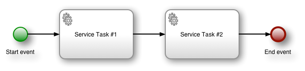
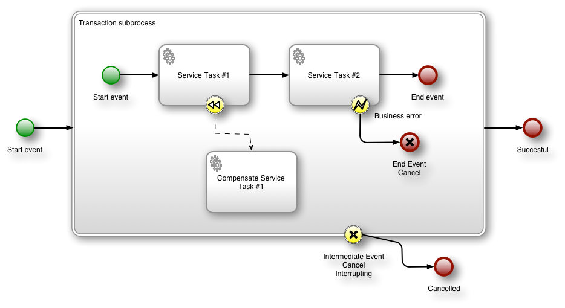

Squeryl, Activiti and transactions
==================================

This is an attempt to clarify how transactions work with Activiti, with Squeryl and how they can be combined.

They go together with the tests in this repository. Please read this document, and then read and execute the tests in this project. To execute the tests, run

    ./sbt test

Activiti Transactions
---------------------

Throughout this explanation, we'll be using the following business process as an example:

#### Normal situation 

Normally, Activiti creates a transaction that spans from the start to the process until a _wait state_ is reached. In this example, the first wait state is after the complete process ended. A transaction is COMtted if the wait state is succesfully reached; in this case, if the process succesfully completed. If an exception is thrown, the transaction is rolled back. So if `Service Task #1` or `Service Task #2` throws an exception, the transaction is rolled back, and the database will not contain any evidence of the process ever having existed.

By default, Activiti has no mechanism for dealing with transactional stuff *inside* service tasks. So `Service Task #1` can handle it's own transaction and commit it's own work. If `Service Task #2` then throws and exception, the Activiti transaction will be rolled back, *but not the transaction that `Service Task 1` performed!*

###### Pros
 * Simplest setup
 * Short transactions, not very sensitive to locking problems
 
###### Cons 
 * Separate transactions for business processes and delegates; rollback of the business process won't undo what delegates did.
 * With externally managed transactions, we can still do this if we want

#### Activiti's general solution for compensation

In general, _rollback_ is not possible for a service task. The task might have sent an email, which can't be undone. 

Activiti's general solution is using _compensation handlers_. A service task can have a _compensating_ task defined; which is task that compensates the actions of the service task. For example, if the original service task used an external webservice to create a hotel booking, the compensating task can cancel the booking. If an email is sent, maybe the compensating task sends another email telling the recipient to ignore the previous one.

In Activiti, compensate handlers can be used in a _transaction subprocess_. If we want to use this in our example process from above, it would look like this:

This makes the model much more complex, because you are forced to consider how to compensate tasks that can't be naturally undone.

This is not intended as a way to roll back from unexpected exceptions in the code, but to undo earlier steps of the business in case of some premeditated _business exception_. In fact, a normal exception won't trigger the compensation.

###### Pros
 * Can compensate non-database side effects
 
###### Cons
 * Intended for premeditated _business_ exceptions, not coding errors
 * Must be explicitly modelled
 * A compensating delegate must be created for each delegate
 
#### Activiti and externally managed transactions

Let's go back to our simple business process:

If the only effects that our delegates cause are _database changes_, we don't need to settle for Activiti's general solution, but we can opt for a much simpler solution.

If we can have a *single* database transaction that spans both what Activiti does and what the delegates do, it's *trivial* to 'compensate' in case of failure, because we can just roll back the transaction.

Activiti supports this use case by allowing transactions to be externally managed. In this configuration, Activiti won't start and commit transactions itself, but it will request transactions externally. The external transaction manager is free to add more to the transaction than just what Activity does.

A natural thing to do is to have Activiti and its delegates share the same transaction, so that in case of an exception both the business process *and* all that the delegates did is rolled back. Also, if there are some related database updates performed *outside* the business process, they can join the transaction as well.

One thing to keep in mind is the size (duration and data touched) of transactions. In this case, there is a single, potentially very big, transaction. While the duration is the same as the 'activiti' transaction in the previous scenarios, here this transaction touches much more data, increasing the chance of locking problems.

To be more specific: If the transaction of `Service Task #1` touches a lot of data, but finishes quickly, and the transaction of `Service Task #2` touches almost nothing, but takes a very long time, no problems are to be expected if they are executed in separate transactions. If they are joined in the same transaction however, there is an increased chance of deadlocks.

##### Transactions in asynchronous Activiti executions

When an Activiti process is started inside an `inTransaction` block, the process and its delegates will join the existing transaction. However, if something is started outside an `inTransaction` block (and this would notably be when Activit's Job Executor runs something, so this includes all activities following one marked as `async`), there is no Squeryl transaction yet. In those cases, `SquerylJoinedTransactionFactory` will start a new Squeryl transaction, for which the commit and rollback is handled by Activiti invoking the proper methods on the `Transaction` that the factory provided to Activiti. 

###### Pros
 * Automatic transaction rollback of *everything* on exceptions
 * No need to have compensating delegates
 
###### Cons
 * Sensitive to deadlocks when transactions take a long time
 * Rollback on exception can only undo database changes, not other side effects
 
Squeryl transactions
--------------------

Squeryl manages transactions by executing code in a `transaction` or an `inTransaction` block. They differ in that an `inTransaction` block will do nothing if it's contained in another transaction, and create a transaction if not. A `transaction` block will always create a transaction. This gives a quite flexible way to stack transactions.

Next are some examples in pseudocode, where we mix updating a value in the database with transactions and exceptions, to show the result of each one. We assume that at the start of each example, the value in the DB is `A`.

Setting a value:

    transaction {
      setValue("B")
    }
  
    // Database now contains B

Setting a value, then throwing an exception will cause a rollback:
  
    transaction {
      setValue("B")
      throw new Exception("Boom!")
    }
  
    // Database still contains A
  
Exception in inner `inTransaction`:

    transaction {
      setValue("B")
      inTransaction {
        setValue("C")
        throw new Exception("Boom!")
      }
    }
    
    // Database still contains A
    
Inner `inTransaction` block, with exception in outer transaction:

    transaction {
      setValue("B")
      inTransaction {
        setValue("C")
      }
      throw new Exception("Boom!")
    }
    
    // Database still contains A

Inner `transaction` block, with exception in outer transaction. In this case the inner one is succesfully committed:

    transaction {
      setValue("B")
      transaction {
        setValue("C")
      }
      throw new Exception("Boom!")
    }
  
    // Database now contains C

Using Squeryl as external transaction manager for Activiti
----------------------------------------------------------
We can configure Activiti to use Squeryl as transaction manager, and have Squeryl return a *new* transaction if Activiti requests one *outside* an existing Squeryl transaction, and have it return the existing one otherwise.

We'll once more use our simple process to see what we can do:

Suppose that we can start the business process with the code `startProcess()`. Now, if our delegates use an `inTransaction` block, we can use the following code:

    inTransaction {
      startProcess()
    }

In this case, there will be a single transaction for Activiti and our delegates. If `Service Task #2` throws an exception, the changes from `Service Task #1` are rolled back, and the business process itself will be rolled back as well. Afterwards, there will have been no changes in the DB.

Any other database access in the Squeryl block will be joined in the transaction as well:

    inTransaction {
      doDbStuff()
      startProcess()
    }

We can also start the process outside a transaction: 

    startProcess()
    
Now, Activiti will get a new transaction. And since the delegates are not executed inside an existing transaction, they will each get their own transaction as well. So if `Service Task #2` throws an exception, it's changes will be rolled back, and the business process will also be rolled back, but the changes from `Service Task #1` will be committed!

This means that if Activiti is invoked outside a Squeryl transaction, it will behave the same as the 'normal' activiti behaviour as described in 'Normal situation'

Potentially, we want to join the Activiti transaction with the delegate transactions and some code outside the process, but we want to some things to be committed independently. For that, we can use a nested `transaction` block. So if `Service Task #1` contains a `transaction` block instead of `inTransaction` and we invoke the Activiti process with:

    inTransaction {
      doDbStuff()
      startProcess()
    }

If `Service Task #2` throws an exception, now the changes performed by `Service Task #1` are committed because they were in a `transaction` block and not an `inTransaction` block, and therefor didn't join the existing transaction.

Note that in all cases, a Squeryl transaction is bound to a `ThreadLocal`, so anything that must run in the transaction must run on the same thread.

The VCS+ situation
==================

In VCS+ we use the setup with Squeryl as external transaction manager for Activiti. Some people are under the impression that this is a _weird_, _abnormal_ or even _bad_ way to use Activiti, but that is not the case.

There are a couple of things to be noted though

#### Different access patterns compared to Perl code

The way we program with a rich domain model in Scala leads to fetching more data and updating more data in the database than functionally equivalent code in Perl.

With Perl, there were mostly fine-grained selects and column-targeted updates. With Scala, we generally populate an entire aggregate of domain classes, and after changing it we persist full classes, instead of just the fields that were changed.

This increases the chance of locking problems.

#### Isolation level

In general, we didn't write our transactions to be safe under concurrency. That means we can only be certain that they behave correctly under *SERIALIZABLE* isolation level, which guarantees that the result of two transactions executed concurrently is the same as running those transactions sequentially.

With lower isolation levels we are vulnerable to race conditions.

#### Retries and side effects

With a high isolation level, there's a significant chance of a transaction failing because of a serialization failure. The solution to that (also noted in the Postgres manual) is to have a generic _retry_ mechanism.

Luckily, Scala's support of higher order functions and _call by name_ support makes this a rather simple task in scala. We can easily create a function `retry` that will retry a block of code passed to it when that code throws a serialization exception:

    retryOnFailure {
      // Some code that will be retried on serialization failure
    }

Of course, non-DB side effects can cause a problem here. If we send an email in this code and the code needs to be retried 3 times before the transaction succesfully commits, the email will be send three times.

In general, we would need a two-phase commit system to solve this.

However, there is a degenerate case where side effects *always work*. Sending an email won't fail because we have a local postfix installation running. So instead of a two-phase commit we can just wait until the DB transaction is committed and then perform the side effects.

We have a library for this, [Lunatech Squeryl Tools](https://github.com/lunatech-labs/lunatech-squeryl-tools).

The problem
-----------

The single biggest problem in the VCS+ is the duration of some transactions. This at least partly because of sloppy coding: using database access in loops. This leads to bad performance, but also to a much higher incidence of serialization failures.

Transactions really should not be longer than a couple of seconds, and the majority should be shorter than a hundred milliseconds.

Long transactions make the serialization failure solution of retrying less effective: We need much more time between retries to have a good chance of succeeding next time. Also, with a high failure rate, we need (much) more retries on average. For transactions that take more than a couple of seconds, retrying quickly becomes infeasible at all and can make it impossible for any transactions to commit succesfully.

#### Suggested solution

Determine where long transactions happen, and work towards reducing their duration and data touched. This should be combined with a general retry-mechanism with suitable delay (we can make this dynamic; based on the duration of the failed transaction) and deferred side effects.

A quick utility to help with finding long transactions is here: [transaction-timer branch of Core WS](https://github.com/elogistics/vcsplus-core-ws/tree/transaction-timer).

Any long transactions that remain and that can't be avoided can be serialized, like we do now with the hanmov and hansta business process dispatchers. If they take a *really* long time and it gets more towards queueing tasks than merely serializing them, we should pick a proper queue system instead of abusing an Akka mailbox as one.

The Bottom of The Document
--------------------------

Wow, you've read it all. Don't forget to go read and execute the tests now!